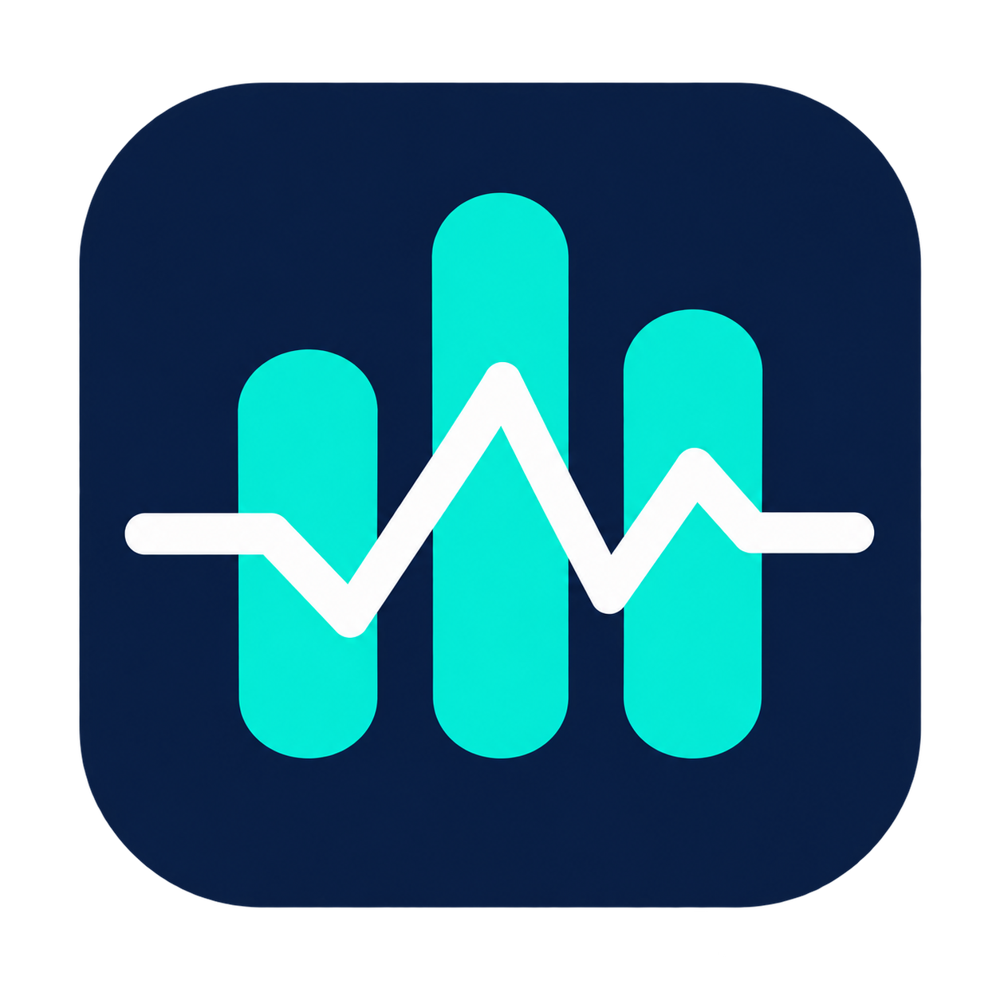

<p align="center">
  
</p>

# MiniStats

**메뉴바에서 Mac의 CPU·메모리를 모니터링하고, 오래된 DerivedData를 골라 정리합니다.**

Apple Silicon용 네이티브 macOS 앱입니다.

## 주요 기능

- **대시보드:** CPU·메모리 실시간 그래프와 네트워크·스토리지·배터리 상태
- **프로세스:** CPU·메모리 상위 3개 미리보기와 상위 5개 상세 정보
- **DerivedData 정리:** 오래된 캐시를 선택해 정리
- **macOS 연동:** 로그인 시 자동 실행, 스토리지 알림, 활성 상태 보기·Finder 바로가기

macOS 26 이상에서는 네이티브 유리 효과를 사용합니다.

## 빌드와 실행

- 실행: Apple Silicon, macOS 13 이상, `/usr/bin/python3`
- 빌드: macOS 26 SDK 이상을 포함한 Xcode 또는 Command Line Tools

```sh
make verify
open build/MiniStats.app
```

[개발 안내](docs/DEVELOPMENT.md) · [버그 제보·기능 제안](https://github.com/oozoofrog/MiniStats/issues)
